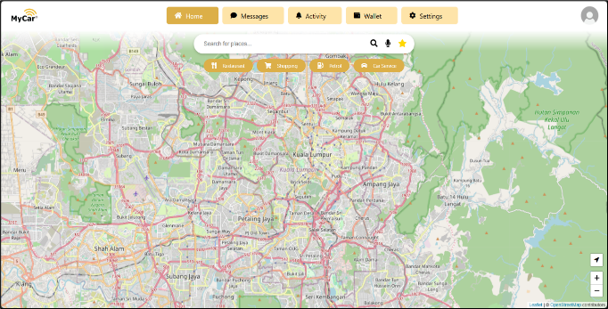
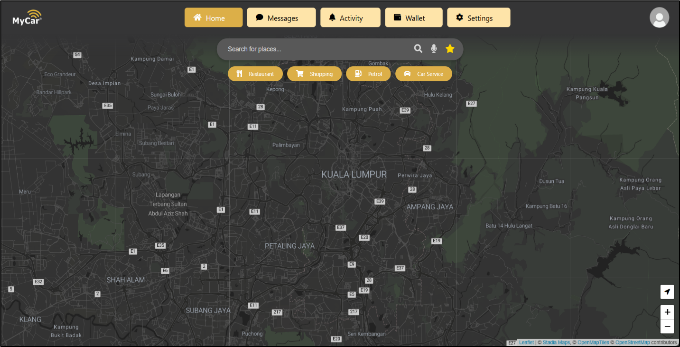

## MyCar Website (Educational Project)
<p align="center">
  
</p>
    
Welcome to the MyCar website! This project is a web-based adaptation of the MyCar e-hailing app, a popular Malaysian ride-hailing service. This website version enables users to conveniently book rides from their computers, expanding accessibility beyond the existing mobile-only platform.

> **Note:** This project is created solely for educational purposes and is not affiliated with or officially endorsed by [MyCar](https://www.mycarasia.com/site/).

## Table of Contents
- [Project Overview](#project-overview)
- [Features](#features)
- [Technologies Used](#technologies-used)
- [Setup](#setup)
- [Usage](#usage)
- [Contributing](#contributing)

## Project Overview
The MyCar website recreates core functionalities of the MyCar app, providing a smooth, user-friendly interface for users to hail rides, track their drivers, and manage bookings. This web-based version aims to improve accessibility and user experience, meeting the unique needs of desktop and mobile users alike in Malaysia’s diverse e-hailing market.

### Appendix
#### Home Page
<p align="center">
  
  <be>
  
</p>
<p align="center">
  Figure: The MyCar home page is displayed in Light Mode (left) and Dark Mode (right).
</p>
    
#### Message Page
<p align="center">
  
  <be>
  
</p>
<p align="center">
  Figure: The MyCar message page is displayed in Light Mode (left) and Dark Mode (right).
</p>
    
#### Activity Page (History Page)
<p align="center">
  
  <be>
  
</p>
<p align="center"> Figure: The MyCar activity history page is displayed in Light Mode (left) and Dark Mode (right). </p>
<p align="center"> ** Active now page still development due not enough time for assignment, so I decided not post pic here. </p>
    
#### Wallet Page
<p align="center">
  
  <be>
  
</p>
<p align="center">
  Figure: The MyCar wallet page is displayed in Light Mode (left) and Dark Mode (right).
</p>
    
#### Settings Page
<p align="center">
  
</p>
<p align="center">
  Figure: The MyCar settings page is displayed in Light Mode, btw settings page also have dark mode.
</p>

#### Booking Page
<p align="center">
  
  <be>
  
</p>
<p align="center">
  Figure: The MyCar booking page is displayed in Light Mode (left) and Dark Mode (right).
</p>

<br>
<br>
*These pic is just the main function/pages, there still have more functions/pages that you need to explore!*

## Features
- **Ride Booking**: Quickly book a ride by entering pickup and destination details.
- **Real-Time Tracking**: Monitor driver location in real-time with an integrated map.
- **User Account Management**: Register, log in, and manage personal ride preferences.
- **Payment Integration**: Secure payments with options for cash, card, and e-wallets.
- **Trip History**: View past rides and receipts for easy reference.
- **Dark Mode**: Toggle between light and dark mode for improved user comfort.

## Technologies Used
- **Frontend**: HTML, CSS, JavaScript
- **Backend**: PHP
- **Database**: MySQL
- **Server**: XAMPP (Apache server)

## Setup
To set up the project locally:

1. **Clone the repository:**
   ```bash
   git clone https://github.com/Wilsomwong2004/MyCar-Website.git
   
2. **Move project files to XAMPP’s htdocs directory:**
   Copy or move the `mycar-website` folder to `C:\xampp\htdocs\` (or the equivalent directory for your XAMPP installation).

3. **Start Apache and MySQL servers:**
   Open XAMPP and start both the Apache and MySQL modules.

4. **Import the database:**
   - Open [phpMyAdmin](http://localhost/phpmyadmin).
   - Create a new database, e.g., `userdata`.
   - Import the provided SQL file into this new database.

5. **Run the application:**
   - Open your browser and navigate to `http://localhost/mycar-website`.

*Tips: Admin - Username:admin , Password:0000*

## Usage
- **Book a ride** by entering a pickup and drop-off location.
- **Track your driver** and monitor ETA in real-time.
- **Access ride history** to view past trips and download receipts.

## Contributing
If you use this repository, please show your support by pressing the star button at the top-right of the page. Your support motivates continued development and improvements!
Yea.. this project is just my education project, and I doesn't plan to continue this project due already submit the assignment.
But We welcome educational collaboration! This project includes APIs to power mapping and other real-time functions. When contributing:

1. Fork the repository and create a new branch (`feature/new-feature`).
2. Make your changes and commit them.
3. Push your branch and open a pull request.

Thank you for your support and contributions!
Also Thanks my partners help a lots on this project!
